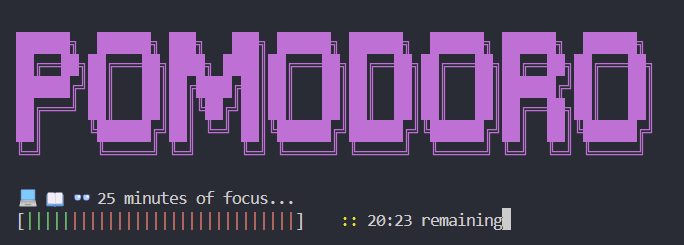

#### Pomodoro timer


Pomodoro timer bash script with no library dependencies.

Starts a pomodoro timer in your terminal. Plays a sounds after timer is done and starts break timer. Also working in `wsl`.
Logs completed pomodoro sessions to `home/<username>/pomodoro_stats.csv` by default

To run the timer, run:
```shell
./pomodoro
```

##### Parameters
Parameters are to be inputed in specific order and are as following:
|**Type**|**Description**|**Example**|**Default**|
|-|-|-|-|
`int`|Determines how long is the work time|`20`|`25`
`int`|Determines how long is the break time|`3`|`5`
`string`|Category that will be saved in the csv file|`"Working on my script"`|`Working`
`int`|Amount of pomodoro cycles|`2`|`1`

##### Config file
`.pomodoro_config` file is created by running `pomodoro` the first time. File contains following configurations:
|**Type**|**Description**|**Example**|**Default**|
|-|-|-|-|
`MINIMALISTIC`|Displays minimalistic ui|`true`|`false`
`THEME`|Theme of the UI|`default`,`miami`,`sunrise`,`dracula`,`mint`,`night`,`ocean`,`seabreeze`|`default`
`PROGRESS_BAR_STYLE`|Determines what kind of progress bar is shown. Options 1-5 exists|`5`|`1`
`STATS_PATH`|Path where `pomodoro_stats.csv` file is created and stats are saved|`/home/user/myfolder`|`/home/user`


##### Commands
|**Command**|**Alias**|**Description**|
|-|-|-|
`--help`|`-h`|Prints help messages
`--version`|`-v`|Prints version information
`--day`|`-d`|Displays daily stats
`--week`|`-w`|Displays data from past 7 days
`--stats`|`s`|Displays all stats

**Optional:** move the `pomodoro` script to `~/.local/bin/` for easier use, run `movetobin.sh` (assuming you already have `local/bin` folder):

```shell
./movetobin.sh
```

After this, just run command from anywhere:
```shell
pomodoro
```
