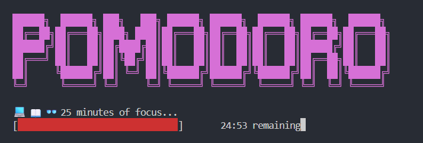

#### Pomodoro timer


Pomodoro timer bash script with no library dependencies.

Starts a pomodoro timer in your terminal. Plays a sounds after timer is done and starts break timer. Also working in `wsl`.

To run the timer, run:
```shell
./pomodoro
```

**Optional:** move the `pomodoro` script to `~/.local/bin/` for easier use, run `movetobin.sh` (assuming you already have `local/bin` folder):
```shell
./movetobin.sh
```

After this, just run command from anywhere:
```shell
pomodoro
```
